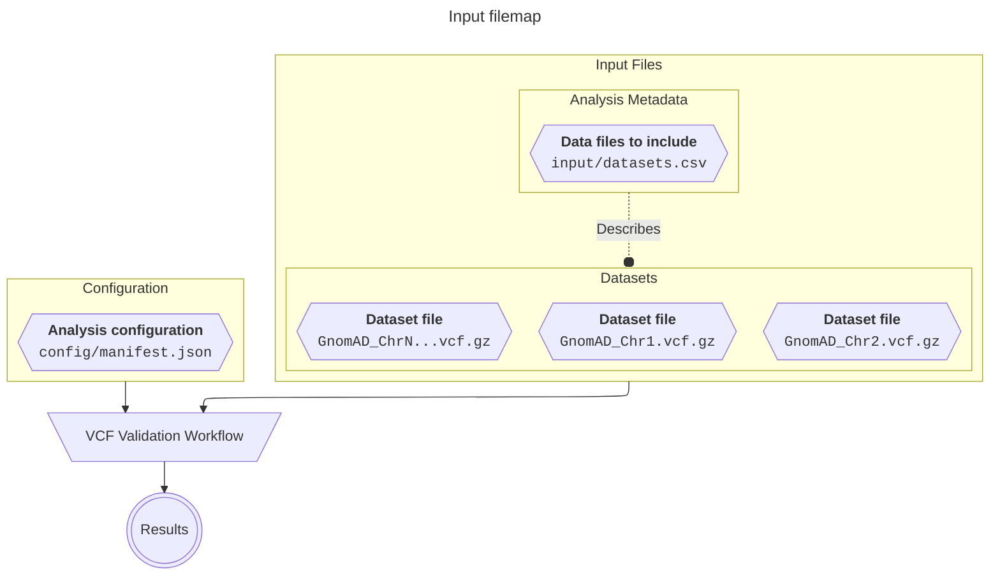

# Data
{: .no_toc }

A summary of the required data and input files needed to perform an analysis.
{: .fs-6 .fw-300 }

<details markdown="block">
  <summary>
    Table of contents
  </summary>
  {: .text-delta }
1. TOC
{:toc}
</details>

---

This page lists the information needed to run the _{{ site.title }}_. Below we guide users through the system used to declare an analysis manifest, and all associated metadata files. For more information, please consult the relevant section below which contains more specific guidance, discussions and technical documentation.

## Overview

To perform an analysis with this workflow, users will need to configure the workflow. This includes providing environment-related information like output locations, as well as analysis settings like reference population selection. This information is all declared and stored using the `config/manifest.json` file.


<details markdown="block" open>
  <summary>Input Data Infographic</summary>
  {: .text-delta }



</details>

## Input Data

This workflow is designed to work on variant-call-format files (<code>.vcf</code> file extension). The latest version of the VCF specification can be found [here](https://samtools.github.io/hts-specs/VCFv4.3.pdf).

### Compression and Indexing

This workflow can accept uncompressed VCF files, however this workflow will compress and index the data during handling for performance reasons. If possible, please provide them in compressed and index form.

## Analysis configuration

To perform an analysis with this workflow, users will need to configure the workflow. This includes providing environment-related information like output locations, as well as analysis settings like reference population selection. This information is all declared and stored using the `config/manifest.json` file.

<h3>The <code>manifest.json</code> file</h3>

This file is responsible for declaring all information relating to the analysis and serves as the central point of contact between the workflow runtime and your input data. It is also used to configure and synchronize any sub-workflows imported internally.

<details markdown="block">
  <summary>
    <code>manifest.json</code> format example
  </summary>
  {: .text-delta }

  <dl>
    <dt><b>input</b> <code>&lt;object&gt;</code></dt>
    <dd>
        <dl>
            <dt><b>datasets</b> <code>&lt;Array&lt;str&gt;&gt;</code></dt>
            <dd>A list representing the file-path to the dataset metadata file. Should be suitable for use with the python <code>os.path.join()</code> function.</dd>
            <dt><b>locations</b> <code>&lt;Array&lt;str&gt;&gt;</code></dt>
            <dd>A list representing the file-path to the location metadata file. Should be suitable for use with the python <code>os.path.join()</code> function.</dd>
            <dt><b>samples</b> <code>&lt;Array&lt;str&gt;&gt;</code></dt>
            <dd>A list representing the file-path to the samples metadata file. Should be suitable for use with the python <code>os.path.join()</code> function.</dd>
            <dt><b>transcripts</b> <code>&lt;Array&lt;str&gt;&gt;</code></dt>
            <dd>A list representing the file-path to the transcript metadata file. Should be suitable for use with the python <code>os.path.join()</code> function.</dd>
        </dl>
    </dd>
    <dt><b>output</b> <code>&lt;Array&lt;str&gt;&gt;</code></dt>
    <dd>A list representing a path to a folder where the results of the analtysis should be stored. If the folder does not exist, it will be created.</dd>
    <dt><b>resources</b> <code>&lt;Object&gt;</code></dt>
    <dd>
        <dl>
            <dt><b>reference_genomes</b> <code>&lt;Array&lt;Object&gt;&gt;</code></dt>
            <dd>
                This property should contain a list of objects, where each object describes a reference genome available for use, using teh following properties:
                <dl>
                    <dt><b>name</b> <code>&lt;str&gt;</code></dt>
                    <dd>The name of the reference genome. Should correspond to value used in dataset metadata file.</dd>
                    <dt><b>location</b> <code>&lt;Array&lt;str&gt;&gt;</code></dt>
                    <dd>A list representative the file-path to the reference genome. Should be provided in FASTA format.</dd>
                </dl>
            </dd>
        </dl>
    </dd>
    <dt><b>parameters</b> <code>&lt;Object&gt;</code></dt>
    <dd>
        <dl>
            <dt><b>fishers-test</b> <code>&lt;object&gt;</code></dt>
            <dd>
            <dl>
                <dt><i><b>cluster_name</b>*</i> <code>&lt;str&gt;</code></dt>
                <dd>The name of the cluster-level declared in your sample metadata file for which you would like to declare a reference population. This population will be used to conduct pair-wise testing against all remaining populations in the column respectively.</dd>
            </dl>
            </dd>
        </dl>
    </dd>
  </dl>

  ```json
  {
    "input": {
        "datasets": [
            "/",
            "path",
            "to",
            "my",
            "dataset",
            "metadata"
        ]
    },
    "output": [
        "/",
        "path",
        "to",
        "my",
        "output",
        "location"
    ],
    "resources": {
        "reference_genomes": [
            {
                "name": "",
                "location": [
                    "/",
                    "path",
                    "to",
                    "my",
                    "reference",
                    "genome"
                ]
            }
        ]
    }
}
  ```
</details>

### Metadata

All data and sample metadata is provided in the form of ` .csv` files declared in the `manifest.json` file. These files allow you to declare datasets and provide the necessary information to determine which contig-level files should be used for analysis given the provided genomic coordinates. For convenience, we will assume standard names for the sake of this explanation:

{: .normal }
> This design-pattern of declaring metadata files via the `manifest.json` was chosen specifically to allow users to create and store analysis configurations and metadata alongside the dataset files, which often has special storage requirements (e.g. space, access, etc). This approach allows centralized dataset management and then only requires that the `manifest.json` file is discoverable under the path `config/manifest.json`. That can be accomplished with a symlink or shortcut, keeping the amount of setup work to a minimum.


#### <code>datasets.csv</code> Metadata

The dataset metadata file allows you to declare information about your datasets to analyze, including the reference genome version and where to locate the files.

{: .highlight }
> Please provide data in the form of multiple <code>*.vcf</code> files split per-contig.

<details markdown="block">
  <summary>
    Format example
  </summary>
  {: .text-delta }

<dl class="def-wide">
  <dt><b>dataset_name</b> <code>&lt;str&gt;</code></dt>
  <dd>The name of the dataset. This value will be used as a universal accessor for that dataset and any information relating to it. This means that any output files will use this value to determine things like filenames, etc. It is also used to connect other metadata to this dataset computationally, E.g. sample-level information.
  
  <br><b><i>E.g.</b> <code>1000G</code></i></dd>
  
  <dt><b>reference_genome</b> <code>&lt;str&gt;</code></dt>
  <dd>An <code>enum</code> indicating which reference genome version this dataset has been called on.
  
  <br><b><i>E.g.</b> <code>GRCh37</code> or <code>GRCh38</code></i></dd>
  
  <dt><b>file</b> <code>&lt;file_path&gt;</code></dt>
  <dd>A file path indicating the location of the dataset to be used in the analysis.
  
  <br><b><i>E.g.</b> <code>GRCh37</code> or <code>GRCh38</code></i></dd>
</dl>

| **dataset_name** | **reference_genome** | **file**                                                    |
| :--------------- | :------------------- | :---------------------------------------------------------- |
| HG002            | GRCh38               | `/nlustre/users/graeme/PUBLIC/GenomeInABottle/HG002.vcf.gz` |
| HG002            | GRCh38               | `/nlustre/users/graeme/PUBLIC/GenomeInABottle/HG002.vcf.gz` |
| HG002            | GRCh38               | `/nlustre/users/graeme/PUBLIC/GenomeInABottle/HG002.vcf.gz` |

</details>
