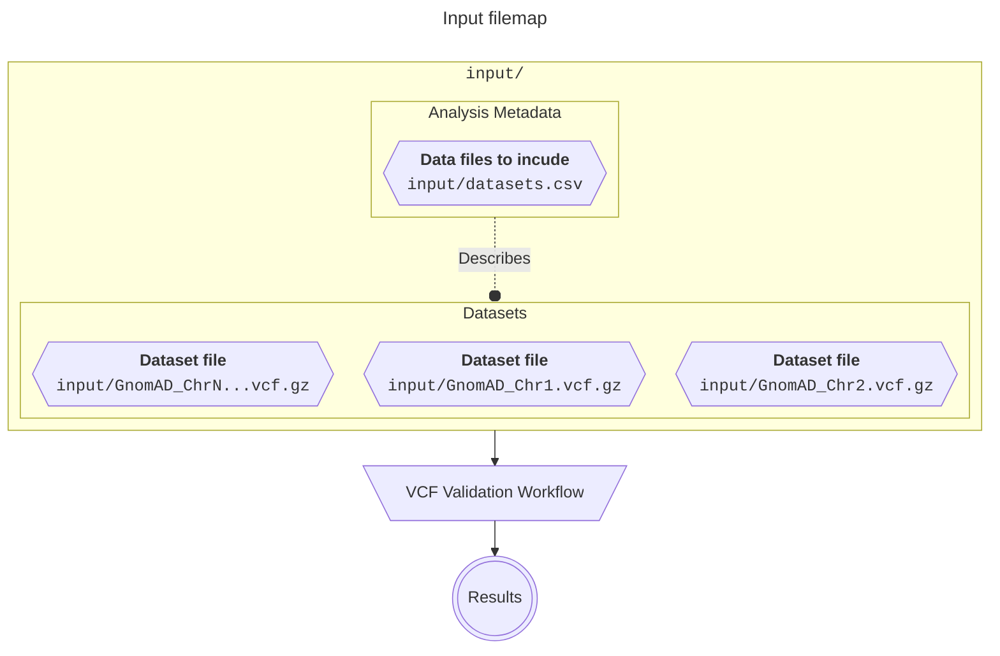

# Data
{: .no_toc }

A summary of all data required in order to use this workflow.
{: .fs-6 .fw-300 }

  

    Table of contents
  

  {: .text-delta }
1. TOC
{:toc}

---

In order to run the <i>{{ site.title }}</i>, you will need to provide samples, and information about those samples. We have described a series of tables below, to describe your samples and datasets for analysis.

## Overview

This workflow makes use of an analysis manifest to encapsulate all analysis variables used. This manifest file collects and connects the metadata for your samples, datasets, and relevant reference resources (Reference Genomes, etc) together. Doing so allows the workflow to programmatically access clusters through sample annotations, which is required in order to produce cluster-level reports.

    
Input Data Infographic

    {: .text-delta }

## Datasets & Files

Please provide all input datasets in the form of _variant-call-format_ or `.vcf` files. The latest version of the VCF specification can be found [here](https://samtools.github.io/hts-specs/VCFv4.3.pdf).

### Dataset Subdivisions

The VCF files provided for analysis should be split by contigs. This convention reduces unnecessary processing times associated with genomic content that is not relevant to the coordinates being targeted.

###  VCF Compression and Indexing

VCF datasets are often quite large in uncompressed form. These files are text-based, and require parsing that reduces I/O performance. They are prone to large sizes by nature, and can contain variable-length annotation columns. For these reasons, this workflow has been configured to convert to remove annotation columns, and perform BGZip-compression and tabix-indexing for the sake of computational efficiency.

{: .normal }
> <b>Block Compression</b> is a non-standard type of compression. This means it is not the same as the default compression type used on Windows or MacOS. At a high level, it is used to compress files in a series of blocks or chunks. It is typically used in tandem with some kind of index, to enable targeted decompression and access of specific records. This eliminates the need to decompress the whole file.
>
> In computational biology applications, block-compression is combined with a <b>Tabix Index</b> to record the coordinate coverage/bounds in each compressed block. This allows targeted decompression of spesific regions for analysis, as opposed to having to parse the entire file until the requested coordinates are found.
>
> Both block-compression and tabix indexing are provided by [SamTools](http://www.htslib.org/doc/bgzip.html).

## Metadata Declarations

To run the _{{ site.title }}_, you will need to provide some additional contextual information. All metadata is provided in the form of appropriately named ` .csv` files located in the `input` directory.

{: .normal-title }
> Case sensitivity
>
> The following metadata declaration files use _**case-sensitive column names**_.

---

<h3><code>datasets.csv</code></h3>

The `datasets.csv` file allows you to declare datasets and provide the necessary dataset-level information for use in this pipeline.

    
<code>datasets.csv</code> format example

    {: .text-delta }
    
<dl class="def-wide">
  <dt>dataset_name <code>&lt;str&gt;</code></dt>
  <dd>The name of the dataset. This value will be used as a universal accessor for that dataset and any information relating to it. This means that any output files will use this value to determine things like filenames, etc. It is also used to connect other metadata to this dataset computationally, E.g. sample-level information.
  
   <strong><i>E.g. <code>1000G</code></i></strong></dd>
  
  <dt>reference_genome <code>&lt;str&gt;</code></dt>
  <dd>An <code>enum</code> indicating which reference genome version this dataset has been called on.
  
   <strong><i>E.g. <code>GRCh37</code> or <code>GRCh38</code></i></strong></dd>
  
  <dt>file <code>&lt;file_path&gt;</code></dt>
  <dd>A file path indicating the location of the dataset to be used in the analysis.
  
   <strong><i>E.g. <code>GRCh37</code> or <code>GRCh38</code></i></strong></dd>
</dl>

| **dataset_name** | **reference_genome** | **file**                                                    |
| :--------------- | :------------------- | :---------------------------------------------------------- |
| HG002            | GRCh38               | `/nlustre/users/graeme/PUBLIC/GenomeInABottle/HG002.vcf.gz` |
| HG002            | GRCh38               | `/nlustre/users/graeme/PUBLIC/GenomeInABottle/HG002.vcf.gz` |
| HG002            | GRCh38               | `/nlustre/users/graeme/PUBLIC/GenomeInABottle/HG002.vcf.gz` |

