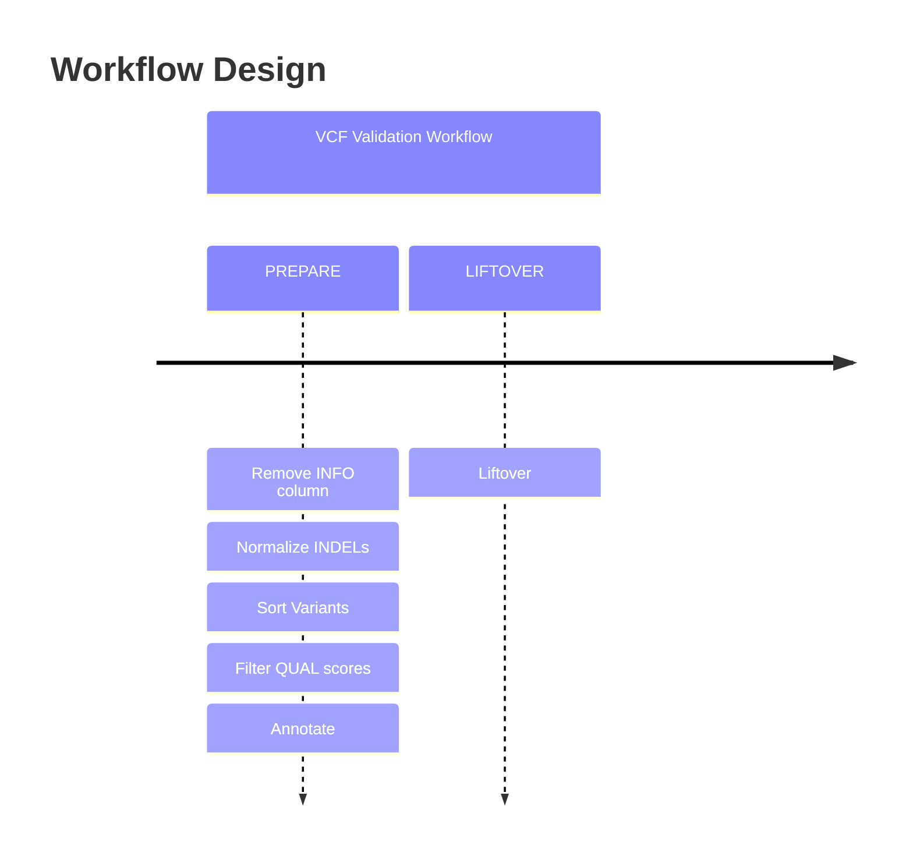

# Introduction
{: .no_toc }

A breakdown of the analyses performed by this workflow.
{: .fs-6 .fw-300 }

<a href="{{ site.baseurl }}/cheat-sheets/quickstart" style="color: #44434d; text-decoration: none;"><strong><i>Cheat-Sheets</i></strong></a>
{: .label .label-yellow }

  

    Table of contents
  

  {: .text-delta }
1. TOC
{:toc}

---

The <i>{{ site.title }}</i> design follows the following order-of-events graph:

