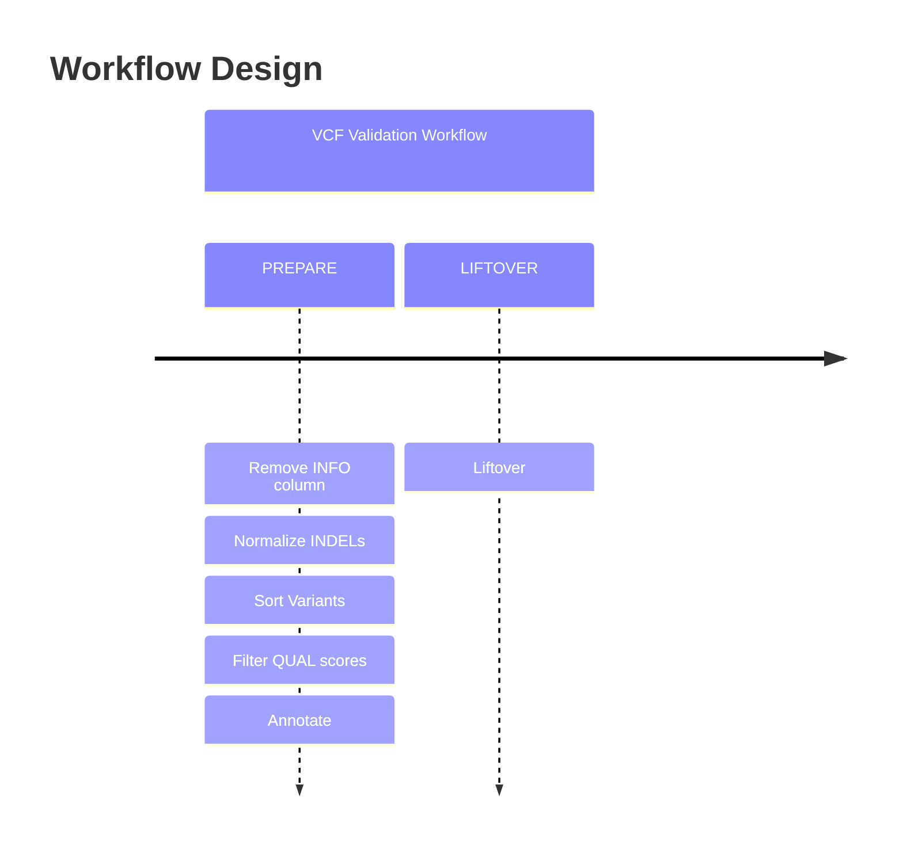

# Workflow Overview
{: .no_toc }

A breakdown of the analyses performed by this workflow.
{: .fs-6 .fw-300 }

[Cheat-Sheets](/cheat-sheets/quickstart)
{: .label .label-yellow }

  

    Table of contents
  

  {: .text-delta }
1. TOC
{:toc}

---

The {{ site.title }} design follows the following order-of-events graph:

